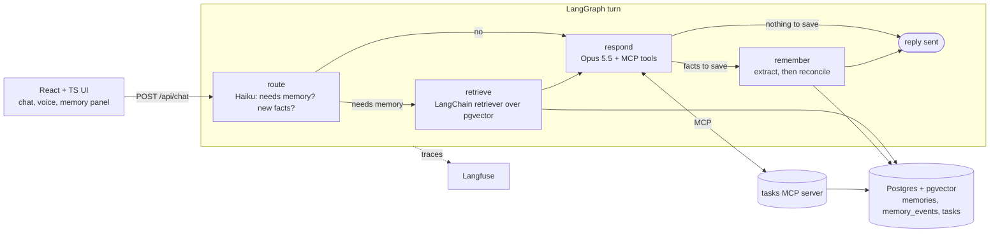

# Juno

**Juno** is a voice-and-chat personal assistant that remembers you across sessions — preferences, ongoing projects, facts you've mentioned — and uses them to personalize answers. The memory system is built from scratch: **extraction → pgvector storage → conflict resolution → relevance-filtered retrieval**, orchestrated by a LangGraph agent, with one MCP tool for "remind me to…".

> **Headline metric — conflict-resolution accuracy: 90% on 10 held-out contradiction cases** (95–100% across two runs on the 22-case dev set) vs **0–5%** for a naive append-only memory on the same dev cases. Contradictions are updated in place with no stale or duplicate facts left. Also: 100% no wrong merges, 100% no duplicates, 100% extraction accuracy (21 cases). [Details ↓](#results)

## Why it's not just "RAG over chat logs"

Storing whole transcripts and retrieving them later gets noisy and stale fast. This system stores **atomic facts**, and treats every write as a correctness problem:

| Problem | How it's handled | Code |
|---|---|---|
| **What's worth remembering?** | After each turn, a cheap model (Claude Haiku 4.5) extracts candidate facts from the user's message and scores each for *durability*. Transient states ("I'm tired today"), questions, task requests and other people's opinions are dropped. Corrections are written as the *current* state ("User lives in Austin", not "User moved"). | [`extraction.py`](backend/app/memory/extraction.py) |
| **Contradictions** ("actually I moved to Austin") | Before writing, the most similar stored facts are retrieved from pgvector. A judge decides `ADD / UPDATE / DELETE / NOOP` and can consolidate older duplicates. Updates rewrite the row **in place**; every change is logged to `memory_events` for an audit trail. | [`reconcile.py`](backend/app/memory/reconcile.py) |
| **Relevance at answer time** | A LangChain retriever returns only facts that clear an absolute similarity floor **and** sit within a margin of the best hit — not the whole memory. | [`retriever.py`](backend/app/memory/retriever.py) |
| **Style preferences apply to everything** | "I prefer concise answers" is never semantically similar to "explain quantum computing", so pure similarity retrieval would miss it. The extractor flags these as **pinned**; pinned facts are injected into every reply. | [`retriever.py`](backend/app/memory/retriever.py) |

### Design decisions worth talking about

- **Two fast paths skip the LLM in conflict resolution.** No similar facts → `ADD` directly; near-identical fact (cosine ≥ 0.985) → `NOOP`. Only the ambiguous middle band pays for a judge call.
- **The judge sees neighbours by index, not UUID**, so it can't hallucinate an id. Out-of-range indices degrade safely (`UPDATE`→`ADD`, `DELETE`→`NOOP`) — covered by tests.
- **Candidates are applied sequentially**, so the second fact from one message sees the first one's write.
- **Thresholds were calibrated on measured similarities**, not guessed. With `bge-small`, "User lives in Seattle" vs "User lives in Austin" is 0.82 — but unrelated pairs like "vegetarian" vs "loves hiking" are 0.69, because every fact starts with "User". So the conflict band is wide (≥ 0.55) and the judge — not the threshold — decides. For retrieval, relevant and irrelevant facts differ by only ~0.1, which is why retrieval uses a relative margin rather than a fixed cutoff.
- **"Forget that…" is a first-class operation**: the extractor emits forget requests; a separate judge picks which facts they cover.
- **Local embeddings** (fastembed / ONNX, CPU) — no second API key, no per-embedding cost.

## Architecture



| Layer | Implementation |
|---|---|
| Fact extraction | `claude-haiku-4-5` structured output (`extraction.py`) |
| Storage | Postgres 17 + pgvector, HNSW cosine index (`store.py`, `db.py`) |
| Conflict resolution | similarity search → fast paths → Haiku judge (`reconcile.py`) |
| Retrieval | LangChain `BaseRetriever` subclass (`retriever.py`) |
| Orchestration | LangGraph `StateGraph` with conditional edges (`agent/graph.py`) |
| Chat model | `claude-opus-5-5`, adaptive thinking, `effort=low` for snappy voice replies, server-side refusal fallback enabled |
| Action tool | MCP server (`mcp_server/tasks_server.py`) — `add_task`, `list_tasks`, `complete_task`; discovered via `list_tools` and passed to Claude |
| Voice | Whisper (local `faster-whisper`) for STT, ElevenLabs for TTS; both fall back to the browser's Web Speech API |
| Frontend | React 19 + TypeScript + Vite; "What I remember about you" panel with live diff of memory changes |
| Observability | Langfuse spans on route / retrieve / respond / extract / reconcile / each LLM call (no-op without keys) |
| Evals | 32 conflict cases + 21 extraction cases, LLM-graded (`evals/`) |

## Quick start

**Prerequisites:** Python 3.11+, Node 20+, Docker Desktop, an Anthropic API key.

```bash
# 1. Database
docker compose up -d

# 2. Config
cp .env.example .env          # then put your ANTHROPIC_API_KEY in .env

# 3. Backend (from backend/)
cd backend
python -m venv .venv
.venv\Scripts\activate         # macOS/Linux: source .venv/bin/activate
pip install -r requirements.txt
uvicorn app.main:app --port 8000

# 4. Frontend (new terminal, from frontend/)
cd frontend
npm install
npm run dev                   # http://localhost:5173
```

Or build the frontend once (`npm run build`) and the backend serves it at http://localhost:8000.

The first backend start downloads the embedding model (~70 MB).

### Optional extras

| Feature | How to enable |
|---|---|
| Whisper speech-to-text | `pip install faster-whisper` (model `base.en` downloads on first use). Without it, the mic uses the browser's speech recognition. |
| ElevenLabs voice | Set `ELEVENLABS_API_KEY` (and optionally `ELEVENLABS_VOICE_ID`). Without it, replies are spoken with the browser's voice. |
| Langfuse tracing | Set `LANGFUSE_PUBLIC_KEY`, `LANGFUSE_SECRET_KEY`, `LANGFUSE_HOST`. |
| Standalone MCP server | `python -m mcp_server.tasks_server --http` then set `MCP_SERVER_URL=http://127.0.0.1:8765/mcp`. Or connect any MCP client over stdio: `python -m mcp_server.tasks_server`. By default the backend connects in-process (still over the MCP protocol). |

## Demo script (2 minutes)

1. "Hi! I'm Sam, I live in Seattle, and I like short answers." → panel shows 3 facts; the style preference lands under **Always applied**.
2. "I'm vegetarian and training for the Chicago marathon in October."
3. Click **New session**. Ask "What should I make for dinner tonight?" → the reply is short and vegetarian; the `used N memories` chip shows exactly which facts were pulled in.
4. "Actually, I just moved to Austin." → the chip shows `↻ updated: lives in Seattle → lives in Austin`; the panel's change log shows the strikethrough.
5. "Remind me to book flights on Friday." → task appears under **Tasks · MCP**.
6. "What do you know about me?"
7. Open Langfuse to show the trace: route decision, retrieved facts with similarities, extraction candidates (kept vs dropped) and the reconcile decision.

## Evals

```bash
cd backend
python -m evals.run_evals                         # conflict + extraction suites
python -m evals.run_evals --suite conflict --baseline   # same cases, append-only memory
python -m evals.run_evals --suite conflict --cases conflict_heldout.json   # held-out set
```

### Results

| Suite | Append-only baseline (2 runs) | v1 | v2 (current, 2 runs) |
|---|---|---|---|
| **Contradictions, dev set (22)** | 0/22, 1/22 | 20/22 (90.9%) | **22/22, 21/22** (100%, 95.5%) |
| **Contradictions, held-out (10)** — headline | — | — | **9/10 (90%)** |
| Additions, no wrong merge (6) | 6/6, 6/6 | 6/6 | 6/6, 6/6 |
| Restatements, no duplicate (4) | 0/4, 0/4 | 4/4 | 4/4, 4/4 |
| Extraction: noise ignored (10) / facts captured (10) / forget (1) | — | 21/21 | — |

**What changed v1 → v2.** Both v1 failures had one root cause: the conflict judge only saw the *extracted* fact ("User does evening workouts"), not the user's words ("I **switched** my workouts…", "my allergy test was **wrong**"). Without that signal it reasonably added a second fact. v2 passes the source message to the judge as evidence. Because that fix came from studying failures on the dev set, I then wrote 10 **new** held-out cases ([`conflict_heldout.json`](backend/evals/conflict_heldout.json)) and ran them once, untuned: 9/10.

**Known failure (held-out).** "Sorry, I mixed that up — my manager is Danielle, Daniel is on another team" extracted *nothing*, so the stale "manager is Daniel" survived. That's an **extraction** miss (the message is mostly about other people), not a conflict-resolution one. It's left unfixed on purpose so the held-out number stays honest.

**Run-to-run variance.** LLM pipelines aren't deterministic, so the dev set was run twice on v2. The one miss in the second run (`implicit-relationship`) correctly removed "User is single" but stored two facts mentioning the boyfriend, which the grader counted as a duplicate.

**Baseline.** Append-only memory essentially never resolves a contradiction and duplicates every restatement — e.g. after "Boston → Denver → Portland" it holds all three cities as current. Its single "pass" was a fluke: the first message happened not to be extracted, so there was nothing stale to leave behind.

All numbers: Claude Haiku 4.5 for extraction/judging, graded by Claude Sonnet 5.5, run 2026-10-01. Per-case memory dumps for the current version are in `backend/evals/results/`.

- **Conflict suite** ([`conflict_cases.json`](backend/evals/conflict_cases.json)) — 32 multi-session dev cases (+10 held-out) run through the real extraction + reconciliation pipeline:
  - 22 **contradictions** (moved city, changed job, corrected name, "I sold my car", implicit ones like "I'm single" → "my boyfriend Sam…", a three-hop Boston → Denver → Portland) — **this pass rate is the headline metric**
  - 6 **additions** that must *not* be merged (second pet, sister's city vs your city)
  - 4 **restatements** that must not create duplicates
- **Extraction suite** ([`extraction_cases.json`](backend/evals/extraction_cases.json)) — 10 noise messages that should produce nothing, 10 that contain durable facts, plus a forget request.
- A case passes only if the current truth is stored, **no stale fact is still asserted**, the current truth isn't duplicated, and all must-keep facts survive. Grading is done by `claude-sonnet-5-5` from a rubric, judging meaning rather than wording; every run writes the full final memory per case to `evals/results/<timestamp>.md|json` so you can audit the grader.
- Runs in a separate `eval` Postgres schema — your real memory is untouched.
- Cost: about 3 Haiku calls per message plus one Sonnet grading call per case — well under a dollar per full run.

## Tests

```bash
cd backend
pytest -q
```

10 offline tests (real Postgres + real embeddings, model calls faked — no API key needed): fast paths, in-place update with an audit trail, consolidation of duplicates, safe handling of bad judge output, retrieval relevance and pinned-fact separation, the MCP round trip, and the full LangGraph turn (route → retrieve → respond with a tool call → remember).

## Project layout

```
backend/
  app/
    agent/graph.py        LangGraph turn: route → retrieve → respond → remember
    memory/extraction.py  durable-fact extraction (Haiku, structured output)
    memory/reconcile.py   conflict resolution: ADD / UPDATE / DELETE / NOOP
    memory/retriever.py   LangChain retriever + pinned facts
    memory/store.py       pgvector fact store + memory_events audit log
    mcp_client.py         MCP tool discovery / calls → Claude tool definitions
    voice.py              Whisper STT, ElevenLabs TTS
    tracing.py            Langfuse (no-op without keys)
    main.py               FastAPI
  mcp_server/tasks_server.py   the MCP tasks server
  evals/                  conflict + extraction suites and the runner
  tests/                  offline tests
frontend/src/             React + TypeScript UI
docker-compose.yml        Postgres 17 + pgvector
```

## Configuration

All settings live in [`backend/app/config.py`](backend/app/config.py) and can be overridden in `.env` — models, effort, retrieval `k` / floor / margin, the extraction durability threshold, and the conflict / duplicate similarity bands. See [`.env.example`](.env.example).
